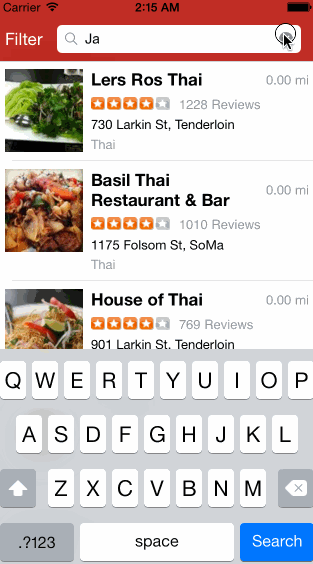

Yelp
==================

This is the Codepath week 2 project Yelp.

Time spent: 7.5 hours

Completed user stories:
* [x] Required: Search results page - table rows has dynamic height according to the content height
* [x] Required: Search results page - custom cells have the proper Auto Layout contstraints
* [x] Required: Search results page = search bar is in the navigation bar
* [x] Required: Filter page - implment filters: category, sort, radius, deals
* [x] Required: Filter page - the filters table is organized into sections as in the mock
* [x] Required: Filter page - use the default UISwitch for on/off states
* [x] Required: Filter page - sort can expand as in the real Yelp app (the requirement says radius filter should be expandable, but in the API, it expects a number in meters rather than a few choices, so I think it makes sense to implement it as a slider. So I can practice both expandable table and slider)
* [x] Required: Filter page - categories show a subset of the full list with a "See All" row to expand
* [x] Required: Filter page - click on the "Search" button dismiss the filter page and trigger the search with the new filter setting

To install
```
cd Yelp
pod install
```

Walkthrough of all user stories


GIF created with [LiceCap](http://www.cockos.com/licecap/).
